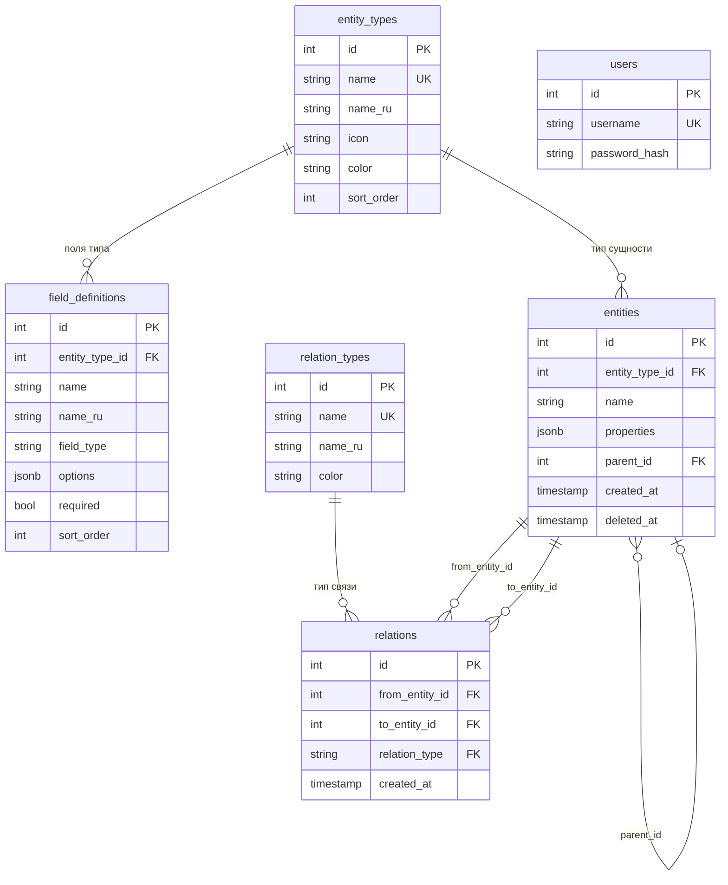
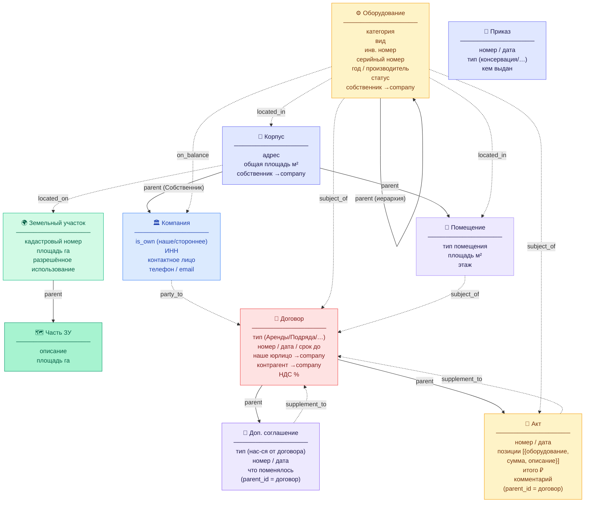

# ER-схема IndParkDocs

> Актуально на: 2026-02-26  
> Миграции: 003–016

---

## Структура таблиц БД



---

## Доменная схема — сущности и связи



---

## Типы связей (relation_types)

| Название | Рус. | Направление |
|---|---|---|
| `located_in` | расположен в | оборудование → корпус / помещение |
| `located_on` | расположен на | корпус → земельный участок |
| `party_to` | сторона договора | компания → договор |
| `subject_of` | предмет договора | оборудование / помещение → договор / акт |
| `supplement_to` | дополнение к | доп.соглашение / акт → договор |
| `on_balance` | на балансе | оборудование → компания (собственник) |
| `rents` | арендует | компания → помещение (устар.) |
| `services` | обслуживает | компания → оборудование (устар.) |
| `installed_on` | установлен на | оборудование → подкрановый путь |

---

## Поля договора по типам (динамические)

| Тип | Дополнительные поля |
|---|---|
| **Аренды / Субаренды** | объекты аренды (помещения/площади/ставки), НДС, комментарии, срок, передача оборудования |
| **Подряда** | предмет, корпус, оборудование, сумма, авансы, срок выполнения |
| **Обслуживания** | описание работ, корпус, оборудование, стоимость, комментарий |
| **Услуг / Купли-продажи** | базовые поля договора |

---

## Иерархия parent_id

```
🌍 Земельный участок
  └─ 🗺 Часть ЗУ

🏢 Корпус (Собственник = наша компания)
  ├─ 🚪 Помещение
  └─ ⚙️ Оборудование
       └─ ⚙️ Оборудование (запчасть/узел)

📄 Договор
  ├─ 📎 Доп. соглашение
  └─ 📝 Акт
```

---

*Не показаны в меню (есть в БД): workshop 🏭, crane_track 🛤, document 📋*
