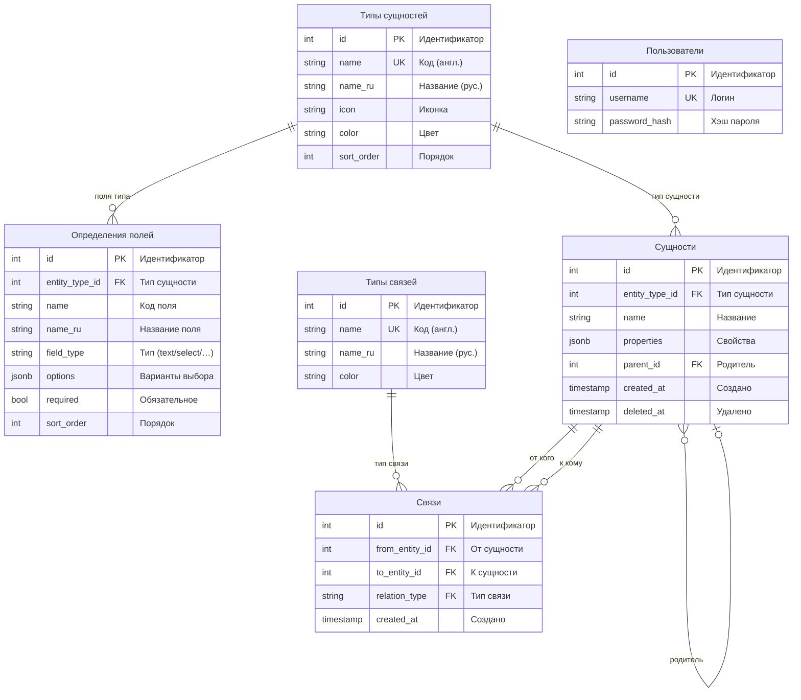
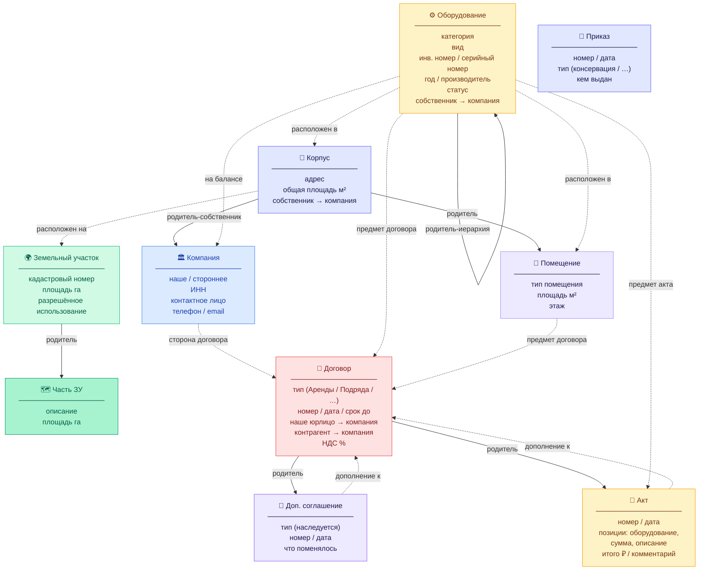

# ER-схема IndParkDocs

> Актуально на: 2026-02-26 | Миграции: 003–016

---

## Структура таблиц БД



---

## Доменная схема — сущности и связи



---

## Типы связей

| Код | Описание | Направление |
|---|---|---|
| `located_in` | **расположен в** | оборудование → корпус / помещение |
| `located_on` | **расположен на** | корпус → земельный участок |
| `party_to` | **сторона договора** | компания → договор |
| `subject_of` | **предмет договора** | оборудование / помещение → договор / акт |
| `supplement_to` | **дополнение к** | доп.соглашение / акт → договор |
| `on_balance` | **на балансе** | оборудование → компания (собственник) |
| `rents` | арендует *(устар.)* | компания → помещение |
| `services` | обслуживает *(устар.)* | компания → оборудование |
| `installed_on` | установлен на *(устар.)* | оборудование → подкрановый путь |

---

## Поля договора по типам

| Тип договора | Дополнительные поля |
|---|---|
| **Аренды / Субаренды** | объекты аренды (помещения / площади / ставки), НДС, комментарии, срок, передача оборудования |
| **Подряда** | предмет, корпус, оборудование, сумма, авансы, срок выполнения |
| **Обслуживания** | описание работ, корпус, оборудование, стоимость, комментарий |
| **Услуг / Купли-продажи / Поставки / Цессии** | базовые поля (номер, дата, стороны) |

---

## Иерархия родителей (parent_id)

```
🌍 Земельный участок
  └─ 🗺 Часть ЗУ

🏢 Корпус  ←  Собственник (наша компания)
  ├─ 🚪 Помещение
  └─ ⚙️ Оборудование
       └─ ⚙️ Оборудование (запчасть / узел / составная часть)

📄 Договор
  ├─ 📎 Доп. соглашение
  └─ 📝 Акт выполненных работ
```

---

*В БД есть, но скрыты в меню: Цех 🏭, Подкрановый путь 🛤, Документ 📋*
